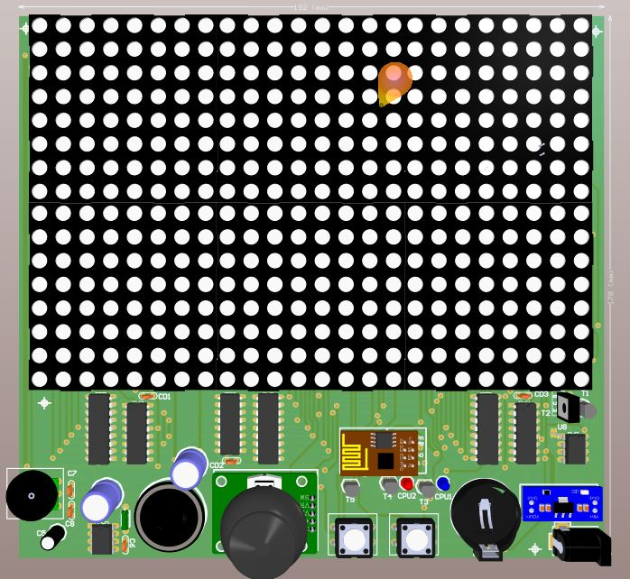
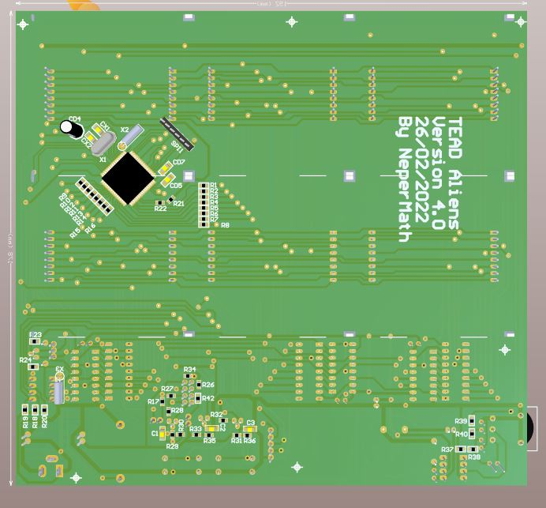

# TEAD Aliens 64A – Retro Game Clock with Embedded System

> ⚠️ This README is available in both [English 🌍](#readme-in-english-) and [Português 🇧🇷](#readme-em-português-)

---

## README in English 🌍

Digital clock project with embedded classic games, based on an Atmel microcontroller programmed in C++. The electronic design and PCB were developed using Altium Designer.

### 🕹️ Available Games

- **TEAD Aliens**: *Space Invaders*-style
- **Centopeia**: classic *Centipede*-style

### 🕒 Clock Display Modes

- **Version 1**: displays **hour and minute**
- **Version 2**: displays **hour, minute, and second**

### ⚙️ System Features

- Complete configuration menu:
  - Date and time setup
  - Game selection
  - Boot configuration
- Visual interface based on numeric LED display
- Fully embedded system controlled via C++ firmware

### 📁 Project Structure

```text
TEad_Aliens_64A/
├── README.md                       # Project description
├── _BMPs/                          # PCB images and references
│
├── _Eletronica/
│   └── Game_TEAD_Aliens_6A-2/      # PCB schematic/layout (Altium Designer)
│
├── _programa/
│   └── c++/
│       └── Game_TEAD_Aliens_64A/   # C++ source code (Atmel Studio)
│
└── other related files and folders
```

### 🔧 Development

- Main language: **C++ (Atmel Studio)**
- Target platform: **Atmel AVR microcontroller**
- Electronic design: **Altium Designer**

### 📦 Project Status

Functional and under development/testing. Includes integrated retro games, configuration menu, and supports two clock display versions.

### 📸 Images

  


### 🛠️ Author

Developed by **Néper**  
Electronics engineering, firmware, and mechanical design.

> This project is part of a full embedded system focused on retro games and clock functions — ideal for educational kits, hobbyist electronics, and retro gaming clocks.

---

## README em Português 🇧🇷

Projeto de relógio digital com jogos clássicos embarcados, baseado em microcontrolador Atmel programado em C++, com design eletrônico e PCB desenvolvidos no Altium Designer.

### 🕹️ Jogos disponíveis

- **TEAD Aliens**: estilo *Space Invaders*
- **Centopeia**: estilo clássico *Centipede*

### 🕒 Modos de exibição do relógio

- **Versão 1**: mostra **hora e minuto**
- **Versão 2**: mostra **hora, minuto e segundo**

### ⚙️ Funcionalidades do sistema

- Menu de configuração completo para:
  - Data e hora
  - Seleção do jogo
  - Boot configurável
- Interface visual baseada em display numérico com LEDs
- Sistema embarcado com controle total via firmware em C++

### 📁 Estrutura do projeto

```text
TEad_Aliens_64A/
├── README.md                       # Arquivo de descrição do projeto
├── _BMPs/                          # Imagens da placa (fotos e referências)
│
├── _Eletronica/
│   └── Game_TEAD_Aliens_6A-2/      # Esquemático e layout da PCB (Altium Designer)
│
├── _programa/
│   └── c++/
│       └── Game_TEAD_Aliens_64A/   # Código-fonte em C++ para Atmel Studio
│
└── outros arquivos e diretórios relacionados
```

### 🔧 Desenvolvimento

- Linguagem principal: **C++ (Atmel Studio)**
- Plataforma alvo: **Microcontrolador Atmel AVR**
- Design eletrônico: **Altium Designer**

### 📦 Status

Projeto funcional e em desenvolvimento/teste. Inclui jogos retrô integrados, menu de configuração e suporte a duas versões de relógio.

### 📸 Imagens

  


### 🛠️ Autor

Desenvolvido por **Néper**  
Engenharia eletrônica, firmware, e design mecânico.

> Este projeto é parte de um sistema embarcado completo com foco em jogos retrô e funcionalidades de relógio — ideal para kits educacionais, eletrônica para hobistas e relógios com games retrô integrados.